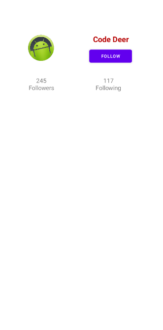

# AndroidBootcampTurkiye

<h1> Bootcamp Days </h1>
<ul>
      <li><a href="https://www.youtube.com/watch?v=WN1zvSa7x54">Android Bootcamp Turkey | Kick-off</a></li>
      <li><a href="https://github.com/maruf04/AndroidBootcampTurkiye/tree/main/BootcampStart">Android Bootcamp Turkey | Build an Interactive App | 24 Şubat</a></li>
      <li><a href="https://github.com/maruf04/AndroidBootcampTurkiye/tree/main/layouts">Android Bootcamp Turkey | Layouts | 27 Şubat</a></li>
      <li><a href="https://github.com/maruf04/AndroidBootcampTurkiye/tree/main/layouts">Android Bootcamp Turkey ...</a></li>
      <li><a href="https://github.com/maruf04/AndroidBootcampTurkiye/tree/main/layouts">Android Bootcamp Turkey ...</a></li>
      <li><a href="https://github.com/maruf04/AndroidBootcampTurkiye/tree/main/layouts">Android Bootcamp Turkey ...</a></li>
      <li><a href="https://github.com/maruf04/AndroidBootcampTurkiye/tree/main/layouts">Android Bootcamp Turkey ...</a></li>
      <li><a href="https://github.com/maruf04/AndroidBootcampTurkiye/tree/main/layouts">Android Bootcamp Turkey ...</a></li>
      <li><a href="https://github.com/maruf04/AndroidBootcampTurkiye/tree/main/layouts">Android Bootcamp Turkey ...</a></li>
      
      
   </ul>
 <h1> Bootcamp Apps </h1>
 <ul>
 <li><a href="https://github.com/maruf04/AndroidBootcampTurkiye/tree/main/layouts">Layouts</a></li>
   </ul>

